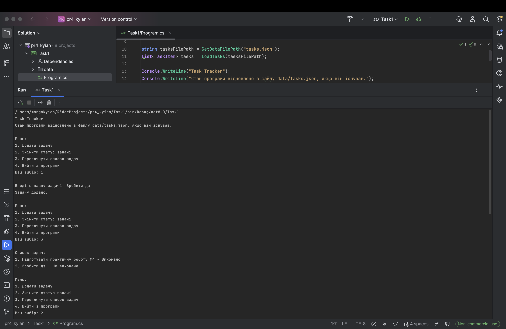
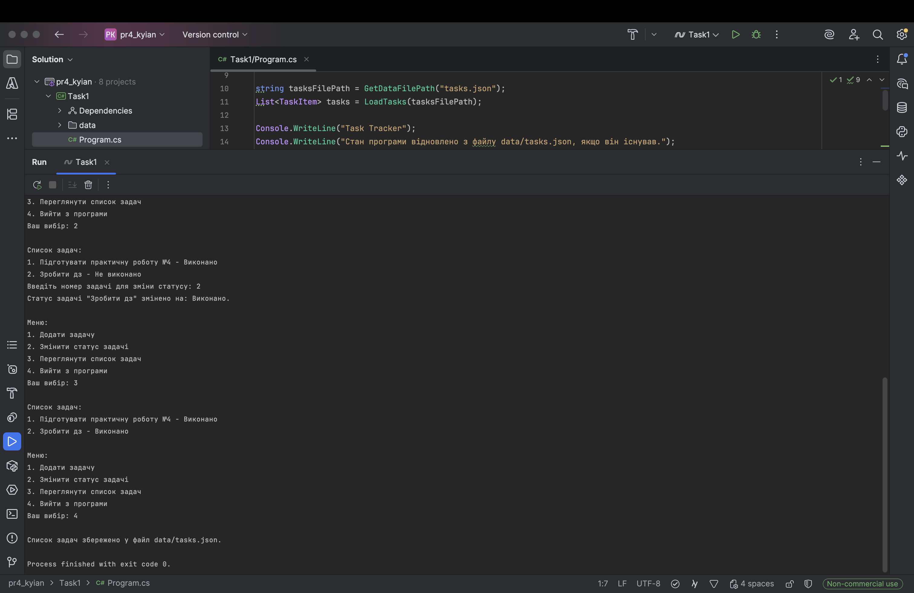
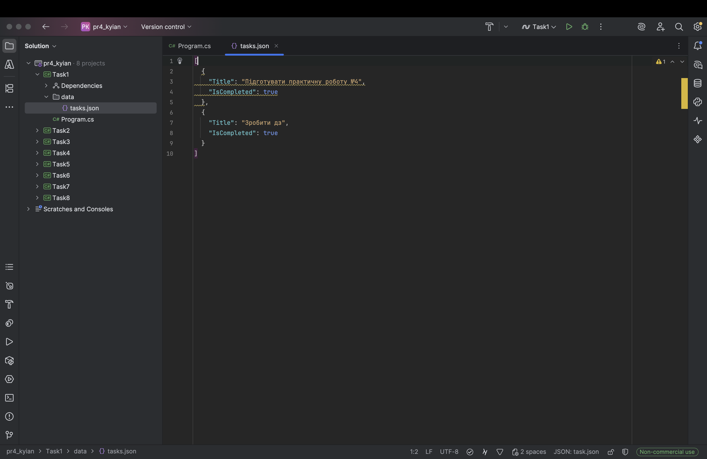
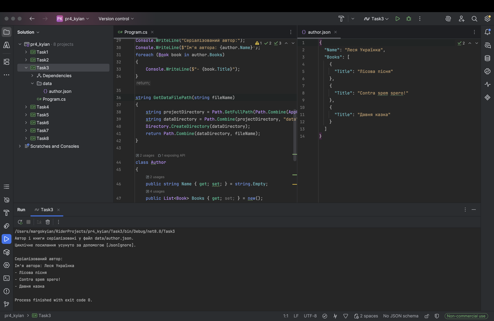
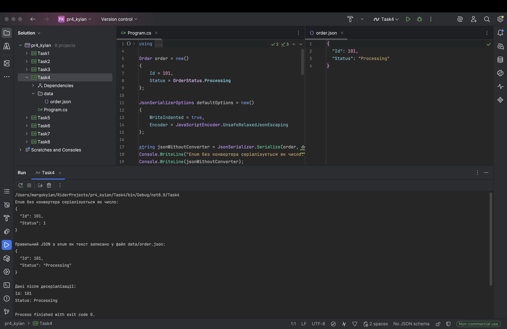
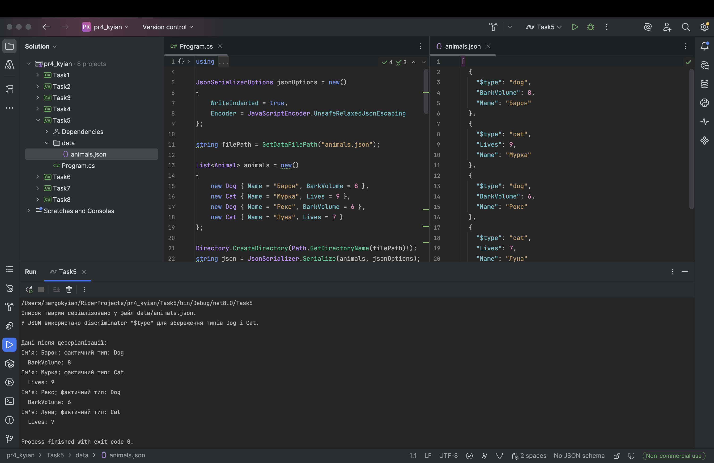
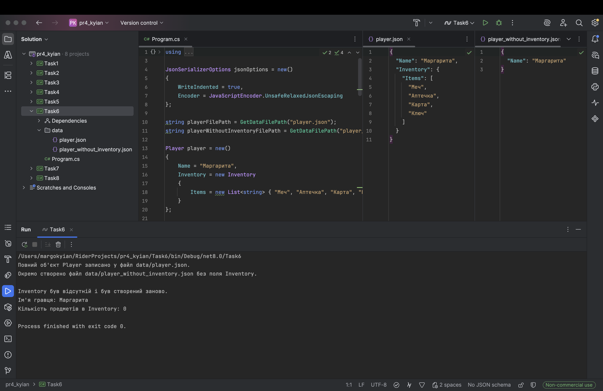
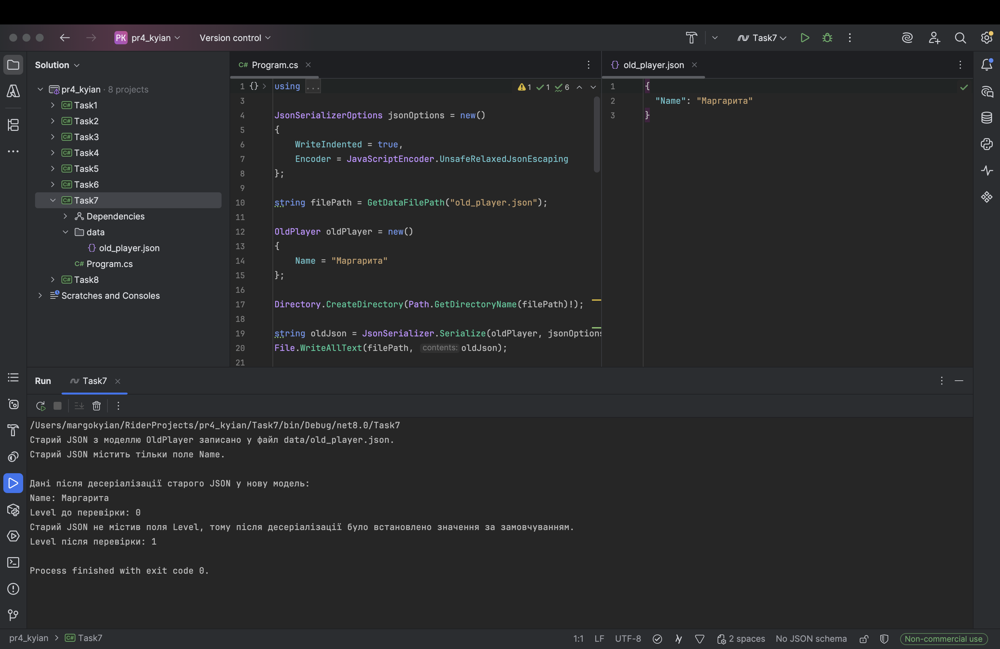
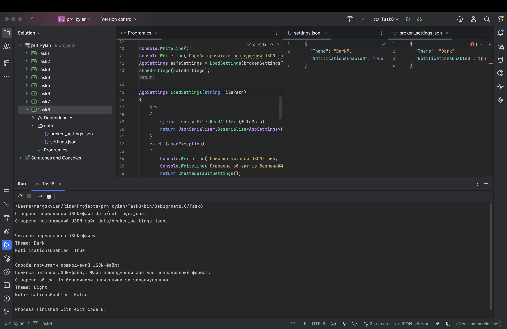

# Практична робота №4

### Виконала: ст. гр. ПД-21 Киян Маргарита

## Перелік проєктів

- `Task1` — Task Tracker і збереження стану.
- `Task2` — серіалізація списку студентів.
- `Task3` — циклічні посилання Author/Book.
- `Task4` — enum як текст у JSON.
- `Task5` — поліморфізм Animal/Dog/Cat.
- `Task6` — вкладені об'єкти Player/Inventory.
- `Task7` — версійність моделей.
- `Task8` — обробка помилок десеріалізації.

## Скріншоти

### Результат виконання завдання №1:

### Результат виконання завдання №2:

### Результат виконання завдання №3:

### Результат виконання завдання №4:

### Результат виконання завдання №5:

### Результат виконання завдання №6:

### Результат виконання завдання №7:

### Результат виконання завдання №8:
