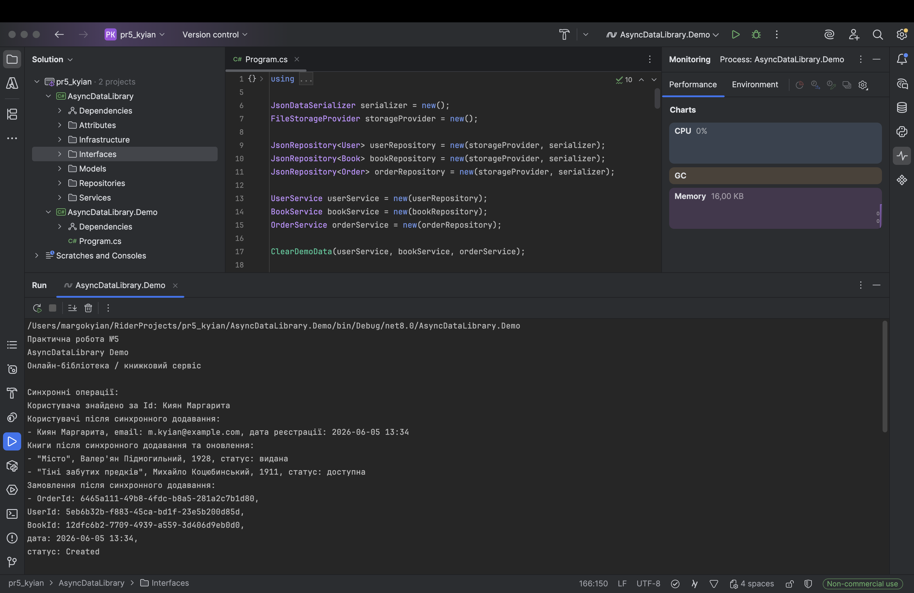

# Практична робота №5

### Виконала: ст. гр. ПД-21 Киян Маргарита

## Мета

- навчитися працювати з `async/await`;
- зрозуміти різницю між синхронними й асинхронними операціями;
- створити перевикористовувану бібліотеку;
- працювати з JSON-серіалізацією;
- застосувати generics, інтерфейси, атрибути;
- реалізувати repository/service підхід.

## Структура проєкту

- `Attributes`
- `Infrastructure`
- `Interfaces`
- `Models`
- `Repositories`
- `Services`
- `AsyncDataLibrary.Demo`

## Основні класи

- `User` — користувач.
- `Book` — книга.
- `Order` — замовлення.
- `DataFileAttribute` — атрибут, який задає назву JSON-файлу для моделі.
- `JsonDataSerializer` — серіалізація та десеріалізація списків.
- `FileStorageProvider` — синхронне та асинхронне читання/запис JSON-файлів.
- `JsonRepository<T>` — generic repository для CRUD-операцій над моделями.
- `UserService` — сервіс для роботи з користувачами.
- `BookService` — сервіс для роботи з книгами та доступними книгами.
- `OrderService` — сервіс для роботи із замовленнями та пошуку замовлень користувача.

## Скріншоти

### Результат виконання завдання:

