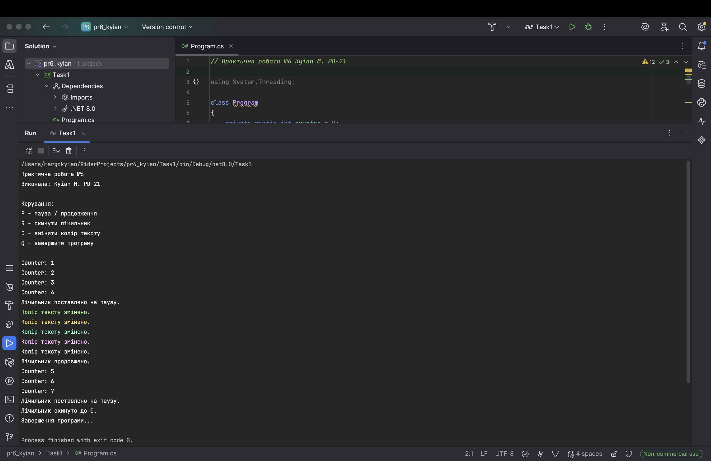

# Практична робота №6

### Виконала: ст. гр. ПД-21 Киян Маргарита

## Мета

- навчитися працювати з `Thread`;
- зрозуміти різницю між основним і фоновим потоком;
- реалізувати обробку клавіш без блокування основного потоку;
- забезпечити потокобезпечність;
- навчитися керувати спільними змінними між потоками.

## Функціонал

- `P` — пауза / продовження лічильника.
- `R` — скидання лічильника.
- `C` — зміна кольору тексту.
- `Q` — завершення програми.

## Скріншоти

### Результат виконання завдання:

